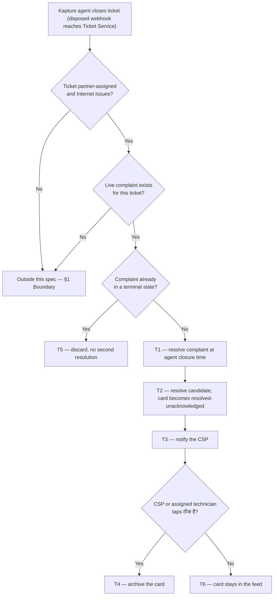

# Kapture Closure Sync — closure reaches the CSP's card

| | | | |
|---|---|---|---|
| **Owner** — Ashish Raj (PM) | **Reviewer** — [TBD — not asked] | **Status** — Draft | **Sign-off** — Pending |
| **Version** — v0.6 · 18 Sep 2026 | **Consulted — Quality OS** — Akhil | **Consulted — Support/Ops** — [TBD — not asked] | **Consulted — TAS eng** — [TBD — not asked] |

---

## 1. Objective & Guardrails

**Objective.** A CSP whose customer's fault Wiom has already closed learns it at once, is never sent to work a job that no longer exists, and is never marked late for a fault that was fixed on time.

**Boundary.** This spec governs a **Kapture-side closure of a partner-assigned Internet Issues ticket that still has a live SRS complaint** — the path that today reaches Ticket Service Java and stops there. It leaves unchanged: the CSP-initiated resolution path, which already works and reaches Kapture in about one second (AC-REG-1); the SHIFTING task family, which keeps today's behaviour entirely (AC-REG-2); the reopen model, where a reopened ticket still creates a fresh complaint with a fresh deadline (AC-REG-3); the connectivity-check verification path, which this spec neither calls nor changes (AC-REG-4); and the Quality resolution signal's payload, which gains no field and loses none, so Quality scores an agent-closed complaint exactly as it scores any other (AC-REG-5). It does change one thing outside itself: the age windows that retire a resolved card stop applying to a resolved-unacknowledged one (R4d). Every other card type keeps today's behaviour (AC-REG-6).

### Guardrails — promises that hold on every path

| ID | Guardrail | One line | Anchors |
|---|---|---|---|
| G1 | **Never late for work done on time** (zero tolerance) | A CSP is never recorded as breaching a deadline for a fault Wiom closed before that deadline. | R1 · R5 · AC-R5-1 · AC-GRD-1 |
| G2 | **A closed fault asks for nothing** | Once the complaint is resolved, the card offers no action that sends the CSP or a technician to the site. | R2 · AC-R2-2 · AC-GRD-2 |
| G3 | **No complaint outlives its ticket** | When Kapture closes the ticket, the complaint reaches a terminal state without waiting for the CSP. | R1 · AC-R1-1 · AC-GRD-3 |
| G4 | **One fault, one resolution** | A single fault produces one complaint resolution and one Quality signal, however many times the closure is delivered. | R1 · AC-DUP-1 · AC-GRD-4 |

---

## 2. Stories, Rules & Acceptance Criteria

### R1 — A Kapture closure resolves the complaint

| ID | Story | MUST | MUST NOT |
|---|---|---|---|
| R1 | As a CSP, when Wiom has already closed my customer's ticket, I want the complaint closed on my behalf so that my card and my deadline stop, without me doing anything. | **(a)** On a Kapture-side closure of a partner-assigned Internet Issues ticket, resolve the open complaint, stamping the resolution at the moment the agent closed it in Kapture. **(b)** Resolve the matching restore execution candidate, to the same end state a CSP's own resolve produces. **(c)** Record the call-centre agent as the actor who resolved it, carrying that agent's own identity through from Kapture — never the CSP, and never a shared system identity. **(d)** Emit exactly one resolution signal for the fault. ⚠️ *AI GENERATED — review*. | Resolve a complaint whose ticket was not closed in Kapture; resolve a second time when the closure is delivered again; leave the complaint open once the closure has been accepted; record a resolution the CSP did not perform as though they performed it. |

| AC | Given / When / Then | Verifies | Status |
|---|---|---|---|
| AC-R1-1 | **Given** ticket 1786508079949000, complaint status `ASSIGNED`, `sla_at` = 2026-08-12T15:00 IST, and restore candidate state `PENDING_ACCEPTANCE`, **When** a Wiom agent closes that ticket in Kapture at 09:20:23 IST on 12 Aug, **Then** the complaint row reads `status` = CLOSED and `resolved_at` = 2026-08-12T09:20:23 IST, and the restore candidate reads `state` = COMPLETED. | R1a · R1b · G3 | Settled |
| AC-R1-2 | **Given** the closure in AC-R1-1, made by the Kapture agent whose employee id is 4417, **When** it is accepted at 09:20:23, **Then** the candidate reads `resolved_by_actor_type` = CC_AGENT and `resolved_by_actor_id` = 4417 — not the CSP a0b6v6, and not the shared system identity 137439087976. | R1c · R1 MUST NOT | Settled |
| AC-R1-5 | **Given** a Kapture closure whose payload carries no closing-agent employee id, **When** it is accepted, **Then** the candidate reads `resolved_by_actor_type` = CC_AGENT with an empty `resolved_by_actor_id`, and it still does not read CSP. | R1c | Settled |
| AC-R1-4 | **Given** the closure in AC-R1-1, **When** it is accepted at 09:20:23, **Then** exactly one resolution signal exists for complaint of ticket 1786508079949000, and `signal_emitted` reads true once. | R1d · G4 | Settled |
| AC-R1-3 | **Given** a ticket on the Wiom Net queue with `is_partnerassigned` = 0 and no row in `COMPLAINTS` for its `ticket_id`, **When** a Wiom agent closes it in Kapture, **Then** still no `COMPLAINTS` row exists for that `ticket_id` and no restore candidate was created. | R1 MUST NOT | Settled |

### R2 — The card says the work is done and asks only for acknowledgement

| ID | Story | MUST | MUST NOT |
|---|---|---|---|
| R2 | As a CSP, I want the card to tell me plainly that Wiom closed this and that nothing is left to do, so that I do not travel to a job that no longer exists. | **(a)** Add an update row to the ticket's Updates list, unread, carrying the supplied copy. **(b)** Change the home card subtitle to the supplied copy. **(c)** Replace the deadline block with the completed treatment the app already uses on a resolved restore — the label `schedule.deadline.completed`, no countdown. **(d)** Offer one action, **ठीक है**, and no other. **(e)** Raise the card in the feed, which by TAS's existing sort is what showing it means. ⚠️ *AI GENERATED — review*. | Offer accept, assign-technician, start-work or resolve on the card; show a running countdown; show the card as still owing work. |

| AC | Given / When / Then | Verifies | Status |
|---|---|---|---|
| AC-R2-1 | **Given** the resolved candidate from AC-R1-1, **When** the CSP opens the service drilldown, **Then** the Updates section shows one unread row reading "कस्टमर ने Wiom को बताया कि उनका नेट चल गया है, इस लिए Wiom ने यह टिकट रीज़ॉल्व कर दिया है", and the unread count reads 1. | R2a | Settled |
| AC-R2-2 | **Given** the same card, **When** the CSP opens the drilldown, **Then** the only action offered is ठीक है — accept, assign technician and resolve are all absent. | R2d · G2 | Settled |
| AC-R2-3 | **Given** the same card, whose `deadline_at` was 2026-08-12T15:00 IST, **When** the CSP opens the drilldown at 09:25 IST, **Then** the schedule block reads "आपकी तरफ से काम पूरा हो गया" and no countdown pill is shown. | R2c | Settled |
| AC-R2-4 | **Given** CSP a0b6v6 holding three other open cards, **When** the agent's closure is accepted at 09:20:23 and the CSP opens the home feed at 09:25, **Then** the card for ticket 1786508079949000 is first in the feed, its subtitle reads "कस्टमर ने बताया नेट ठीक हो गया है", and it carries an unread badge. | R2b · R2e | Settled |

### R3 — The CSP is told without opening the app

| ID | Story | MUST | MUST NOT |
|---|---|---|---|
| R3 | As a CSP who is not looking at the app, I want to be told that Wiom closed the ticket so that I stop working it. | **(a)** Send a push notification to the CSP when the closure is accepted and the CSP has not already resolved the ticket. **(b)** Opening the notification lands the CSP on the service drilldown for that ticket, showing ठीक है. **(c)** Opening the ticket directly lands on the identical screen. | Send the notification when the CSP's own resolve was the one that closed the ticket. ⚠️ *AI GENERATED — review*. |

| AC | Given / When / Then | Verifies | Status |
|---|---|---|---|
| AC-R3-1 | **Given** ticket 1786508079949000 with the CSP's app installed and the complaint open, **When** the closure from AC-R1-1 is accepted, **Then** a push notification reaches the CSP's device within C-01 [TBD — not asked]. | R3a | OPEN |
| AC-R3-2 | **Given** that notification, **When** the CSP taps it, **Then** the app opens the service drilldown for ticket 1786508079949000 with the ठीक है action visible — the same screen reached by opening the card from the feed. | R3b · R3c | Settled |
| AC-R3-3 ⚠️ *AI GENERATED — review* | **Given** a ticket the CSP resolved in the app at 09:19, **When** Kapture records its own closure at 09:20 as the downstream echo of that resolve, **Then** no push notification is sent. | R3 MUST NOT · T5 | Settled |

### R4 — Acknowledgement archives the card

| ID | Story | MUST | MUST NOT |
|---|---|---|---|
| R4 | As a CSP, I want tapping ठीक है to clear the card from my list, so that my feed holds only work I still owe. | **(a)** On ठीक है, move the card to the archive. **(b)** Accept the tap from the CSP who owns the card or from the technician assigned to it. **(c)** Until the tap, keep the card in the feed — indefinitely, and **active**: it renders as live work carrying its actionable state, not as a finished card. **(d)** Exempt a resolved-unacknowledged card from the age-based windows that retire an ordinary resolved card, so that acknowledgement is the only thing that moves it. | Archive the card before it is acknowledged; remove it from the feed because time has passed; render it as finished, greyed or unactionable while it still awaits the tap; reopen or re-activate the complaint on the tap; accept the tap from anyone other than the card's CSP or its assigned technician. |

| AC | Given / When / Then | Verifies | Status |
|---|---|---|---|
| AC-R4-1 | **Given** the resolved, unacknowledged card from AC-R1-1, **When** the CSP taps ठीक है, **Then** the card is no longer in the feed, it is retrievable in the archive, and the complaint remains CLOSED with `resolved_at` unchanged at 09:20:23. | R4a · R4 MUST NOT | Settled |
| AC-R4-2 | **Given** the same card with technician T assigned before the closure, **When** T taps ठीक है, **Then** the card archives exactly as in AC-R4-1. | R4b | Settled |
| AC-R4-3 | **Given** the same card, **When** a CSP who does not own it opens it, **Then** ठीक है is not offered and the card does not archive. | R4b · R4 MUST NOT | Settled |
| AC-R4-5 | **Given** the closure accepted at 09:20:23, **When** CSP a0b6v6 opens the feed at 09:21 without tapping ठीक है, **Then** the card is in the feed, not the archive. | R4c · R4 MUST NOT | Settled |
| AC-R4-6 | **Given** the resolved-unacknowledged card from AC-R1-1, **When** CSP a0b6v6 opens the feed at 09:25, **Then** the card renders as active — not greyed — and carries its actionable state, so ठीक है can be tapped. | R4c · R4 MUST NOT | Settled |
| AC-R4-4 | **Given** the card resolved at 09:20:23 on 12 Aug and never acknowledged, **When** the CSP opens the feed on 20 Aug — eight days later — **Then** the card is still in the feed, still carrying ठीक है. | R4c · R4d | Settled |

### R5 — Quality scores the CSP at the moment the fault was fixed

| ID | Story | MUST | MUST NOT |
|---|---|---|---|
| R5 | As a CSP, I want to be judged on when my customer's fault was actually fixed, not on when I got round to tapping a button, so that I am not penalised for a sync failure. | **(a)** Score the complaint against the agent's closure time, not the acknowledgement time. **(b)** Keep the complaint on the CSP's scorecard — the call-centre agent performed the resolution (R1c), but the fault was the CSP's to fix and its TAT outcome stays theirs. | Record the complaint as breaching its deadline when the agent's closure fell before that deadline; score the ticket against the ठीक है tap; let the identity of the resolving actor change the score. |

| AC | Given / When / Then | Verifies | Status |
|---|---|---|---|
| AC-R5-1 | **Given** ticket 1786508079949000, raised 09:17, `sla_at` 15:00, closed by the agent at 09:20:23 and acknowledged by the CSP at 16:59, **When** the resolution ledger is written, **Then** it reads `resolved_within_tat` = true and `excluded_from_scoring` = false. | R5a · G1 | Settled |
| AC-R5-3 | **Given** the closure in AC-R1-1, **When** the ledger row is written, **Then** its `csp_id` is a0b6v6 and it counts toward that CSP exactly as a CSP-performed resolution does — Quality does not differentiate on who resolved it. | R5b | Settled |
| AC-R5-2 | **Given** ticket 1786419974996000, raised 2026-08-11T09:12:34 IST with `sla_at` 2026-08-11T15:00, closed by the agent at 2026-08-12T17:18:17 — 26 h 18 min past the deadline, **When** the ledger is written, **Then** it reads `resolved_within_tat` = false. Closure sync does not rescue a fault that was already late. | R5a | Settled |

---

## 3. System Behaviour

### 3a. System flow chart

**Precedence:** a CSP resolve and a Kapture closure landing at the same instant resolve by first arrival — whichever reaches SRS first takes effect as T1, and the second is discarded as T5 (AC-RACE-1).

### 3b. State transition table — canon

Lifecycle of a **restore execution candidate** (created by SRS when it classifies a complaint). The complaint's own lifecycle sits in SRS and is out of scope except where these rows name it; the reopen lifecycle is out of scope entirely (§1 Boundary).

| ID | From | Action / Trigger | Rule / Check | To | Side-effects |
|---|---|---|---|---|---|
| T1 | PENDING_ACCEPTANCE · ACCEPTED · ASSIGNED_TECHNICIAN · IN_PROGRESS · AWAITING_VERIFICATION | Kapture closure accepted | Ticket partner-assigned, Internet Issues, complaint not terminal | (complaint CLOSED) | Complaint resolved with `resolved_at` = the agent's closure instant (R1a); one resolution signal emitted (R1d); scored against that instant (R5a). |
| T2 | PENDING_ACCEPTANCE · ACCEPTED · ASSIGNED_TECHNICIAN · IN_PROGRESS · AWAITING_VERIFICATION | T1 completed | — | COMPLETED (unacknowledged) | Candidate resolved, recording the call-centre agent and that agent's identity as the resolving actor (R1c); card becomes resolved-unacknowledged — active and actionable, update row added unread, home subtitle changed, deadline block replaced, ठीक है the only action (R2a–d, R4c); card raised in the feed (R2e). |
| T3 | COMPLETED (unacknowledged) | T2 completed | CSP's own resolve was not the trigger | COMPLETED (unacknowledged) | Push notification sent within C-01 (R3a), deep-linking to the drilldown (R3b). |
| T4 | COMPLETED (unacknowledged) | CSP or assigned technician taps ठीक है | Actor owns the card or is its assigned technician | COMPLETED (archived) | Card leaves the feed and is retrievable in the archive (R4a); complaint untouched (R4 MUST NOT). |
| T5 | COMPLETED · CANCELLED | Kapture closure accepted | Complaint already terminal | COMPLETED · CANCELLED | Closure discarded; no second resolution, no second signal, no notification (G4, R3 MUST NOT). |
| T6 | COMPLETED (unacknowledged) | Time passes, no acknowledgement | — | COMPLETED (unacknowledged) | Card stays in the feed, active and actionable, unchanged and unaged (R4c, R4d). No window retires it. |
| T7 ⚠️ *AI GENERATED — review* | COMPLETED (archived) | Kapture reopens the ticket within 48 h | — | (out of scope) | A fresh complaint and a fresh card are created by the existing reopen path; this candidate is untouched (§1 Boundary, AC-REG-3). |
| T8 ⚠️ *AI GENERATED — review* | CANCELLED | Kapture closure accepted | — | CANCELLED | Not reachable as a change: a cancelled candidate is terminal, so the closure is discarded by T5. |

---

## 4. Cross-cutting Acceptance Criteria

| AC | Given / When / Then | Verifies | Status |
|---|---|---|---|
| AC-WF-1 | **Given** ticket 1786508079949000 raised 09:17 with `sla_at` 15:00 and a card at PENDING_ACCEPTANCE, **When** the agent closes it in Kapture at 09:20:23 and the CSP taps ठीक है at 16:59, **Then** the complaint closed at 09:20:23, the ledger reads `resolved_within_tat` = true, no technician was ever dispatched, and the card sits in the archive. | T1 · T2 · T3 · T4 · G1 · G2 | Settled |
| AC-WF-2 | **Given** the same ticket, **When** the agent closes it at 09:20:23 and the CSP never opens the app, **Then** the complaint is still CLOSED, the ledger still reads `resolved_within_tat` = true, and the CSP's score is unaffected by the missing acknowledgement. | T1 · T2 · T6 · G1 · G3 | Settled |
| AC-WF-3 | **Given** a card at ASSIGNED_TECHNICIAN with technician T due on site, **When** the agent closes the ticket in Kapture, **Then** the card offers only ठीक है, and T has no action that sends them to the site. | T2 · G2 | Settled |
| AC-FAIL-1 | **Given** a Kapture closure accepted at 09:20:23, **When** C-02 [TBD — not asked] has elapsed and the complaint is still not CLOSED, **Then** the closure is visible to Support/Ops as undelivered, carrying the ticket id and the agent's closure instant, so that the complaint can be closed against that instant rather than against the CSP. | R1a · C-02 · G1 | OPEN |
| AC-REG-1 | **Given** a card at ACCEPTED whose complaint is open, **When** CSP a0b6v6 taps Resolve in the app at 11:00:00, **Then** the complaint's `resolved_at` is 11:00:00, the Kapture ticket reaches `is_resolved` = 1, and no ठीक है card and no push notification are produced for that ticket. | §1 Boundary | Settled |
| AC-REG-2 | **Given** a SHIFTING candidate in `RESTORE_EXECUTION_CANDIDATES` with `task_family` = SHIFTING at state ACCEPTED, **When** a Wiom agent closes its ticket in Kapture, **Then** the candidate's `state` and `is_csp_actionable` are unchanged, no update row is added to it, and its allowed actions still include the shifting set. | §1 Boundary | Settled |
| AC-REG-3 | **Given** an acknowledged, archived card from AC-R4-1, **When** an agent reopens that ticket in Kapture 20 hours later, **Then** a second `COMPLAINTS` row exists for that `ticket_id` with its own `sla_at`, a second candidate exists, and the archived candidate's `state` and `resolved_at` are unchanged. | §1 Boundary · T7 | Settled |
| AC-REG-4 | **Given** a complaint with `secondary_subtype` = NO_INTERNET, **When** CSP a0b6v6 taps Resolve in the app, **Then** the complaint's `verification_method` and `system_verification_result` are written exactly as they are today, and no closure-sync path has read or altered either. | §1 Boundary | Settled |
| AC-REG-5 | **Given** the closure in AC-R1-1, **When** SRS emits `COMPLAINT_RESOLUTION_SIGNAL`, **Then** the payload carries the same 25 fields it carries for a CSP-performed resolution, with `csp_id` = a0b6v6, `within_tat` = 1 and `executor_type` = CSP — no actor field is added, and Quality's scoring is byte-for-byte what it would have been. | §1 Boundary · R5 MUST NOT | Settled |
| AC-REG-6 | **Given** an ordinary resolved restore card that was acknowledged, and a completed install card, **When** each passes its 7-day and 30-day boundary, **Then** both retire exactly as they do today — the exemption reaches resolved-unacknowledged cards only. | §1 Boundary · R4d | Settled |
| AC-GRD-1 ⚠️ *AI GENERATED — review* | **Given** every complaint closed by a Kapture closure that landed before its `sla_at` across a full month, **When** the ledger is read, **Then** none reads `resolved_within_tat` = false. On the month measured this converts 410 recorded breaches to on-time. | G1 · R5a | Settled |
| AC-GRD-2 | **Given** a resolved-unacknowledged card reached from each of PENDING_ACCEPTANCE, ACCEPTED, ASSIGNED_TECHNICIAN, IN_PROGRESS and AWAITING_VERIFICATION in turn, **When** the CSP opens each one, **Then** every one offers ठीक है alone — accept task, assign technician, start work and resolve are absent from all five. | G2 · R2d | Settled |
| AC-GRD-3 ⚠️ *AI GENERATED — review* | **Given** every partner-assigned Internet Issues ticket closed in Kapture across a full month, **When** complaint statuses are read seven days later, **Then** none is still open. On the month measured, 1,774 were. | G3 · R1a | Settled |
| AC-GRD-4 | **Given** one fault, **When** its ticket is closed in Kapture and the closure is delivered three times, **Then** exactly one complaint resolution and one resolution signal exist. | G4 · R1d | Settled |
| AC-RACE-1 | **Given** a card at ACCEPTED, **When** the CSP taps Resolve at 09:20:23.100 and the agent's Kapture closure arrives at 09:20:23.400, **Then** the complaint carries `resolved_at` = 09:20:23.100 from the CSP's own resolve, the Kapture closure is discarded, and no ठीक है card or notification is produced. | T5 · R3 MUST NOT | Settled |
| AC-DUP-1 | **Given** the closure from AC-R1-1 already accepted and the complaint CLOSED, **When** the same closure is delivered again, **Then** `resolved_at` is unchanged at 09:20:23, no second signal is emitted, and no second notification is sent. | T5 · G4 | Settled |
| AC-DUP-2 | **Given** the resolved, unacknowledged card, **When** the CSP taps ठीक है twice within one second, **Then** the card archives once and the second tap changes nothing. | T4 | Settled |
| AC-BV-1 | **Given** the card resolved at 2026-08-12T09:20:23 and never acknowledged, **When** the CSP opens the feed at 2026-08-19T09:20:22 — one second inside the 7-day window that would retire an ordinary resolved card — **Then** the card is in the feed. | R4c · R4d | Settled |
| AC-BV-2 | **Given** the same unacknowledged card, **When** the CSP opens the feed at 2026-08-19T09:20:24 — one second past that window — **Then** the card is still in the feed, not the archive: the window does not apply to it. | R4d | Settled |
| AC-BV-3 | **Given** the same unacknowledged card, **When** the CSP opens the feed at 2026-09-11T09:20:24 — one second past the 30-day retention that would delete an ordinary resolved card — **Then** the card is still in the feed. An unacknowledged card is never deleted by age. | R4d | Settled |
| AC-BV-4 | **Given** a CSP with zero other cards, **When** the agent's closure is accepted, **Then** the resolved-unacknowledged card is the only card in the feed and is first by definition. | R2e | Settled |

---

## 5. Configurability

| ID | Parameter | Value / Default | Kind | Range · Owner · Why configurable |
|---|---|---|---|---|
| C-01 | Kapture closure accepted → push notification reaches the CSP | [TBD — not asked] | Fixed | — |
| C-02 | Kapture closure accepted → complaint CLOSED, or the closure is visible to Support/Ops as undelivered | [TBD — not asked] | Fixed | — |

**Why C-02 exists.** The relay's call to SRS is a single synchronous HTTP POST: on a 4xx/5xx or an exception it logs and returns (`SrsClient.java:165-205`). There is no retry, no queue and no reconciliation, so a closure that fails to land is lost in silence — the complaint stays open, the card stays live, and the CSP takes a breach for a fault that was fixed on time. That is G1 broken by a dropped message, with a log line as the only trace. The window is what turns it into something anyone notices.

---

## 6. Impacted Systems & References

| System / Service | Impact | Reference material | What was checked · ACs grounded on it |
|---|---|---|---|
| Ticket Service Java | Must send the closure onward to SRS — the single missing link | `controller/KaptureTicketController.java:842,892` (disposed webhook sets local status RESOLVED with system user 137439087976); `client/SrsClient.java` | The webhook already receives every Kapture closure and already resolves the ticket locally. `SrsClient` has only `notifyComplaint` and `notifyReopenComplaint` — there is no close or resolve call, which is precisely why the closure stops here. **The closing agent's identity already arrives**: `KaptureTaskDetails.java:101-102` declares `ticketCloseEmpId`, and a repository-wide search finds no read of it — it is deserialised and dropped, after which the closure is stamped with the shared system id 137439087976. R1c needs no new field from Kapture, only that this one stops being discarded. **Delivery to SRS has no safety net**: `SrsClient.java:165-205` is a single synchronous POST that logs and returns on a 4xx/5xx or an exception — no retry, no queue, no reconciliation — so a dropped closure is silent. That is what C-02 exists to bound · AC-R1-1 · AC-R1-2 · AC-R1-3 · AC-FAIL-1 |
| SRS — `csp-support-resolution-service` | Must accept a closure and resolve the complaint | `api/InboundEventController.java:31` (`/srs/events/*`, 9 existing inbound event endpoints); `COMPLAINTS` columns `status`, `resolved_at`, `closed_timestamp`, `sla_at`, `within_tat`, `signal_emitted`, `verification_method`, `system_verification_result` | An inbound-event endpoint pattern already exists and is the natural home for this; `resolved_at` is a distinct column from `closed_timestamp`, and scoring keys on the former. The verification columns are named so AC-REG-4 has an observation point · AC-R1-1 · AC-R5-1 · AC-REG-4 |
| TAS restore — `csp-tas-service` | Already completes the candidate on `COMPLAINT_RESOLVED`; must additionally hold a resolved-but-unacknowledged card and accept the acknowledgement. Must not act on the SHIFTING family | `application/impl/InboundEventProcessingServiceImpl.java:94-119`; `domain/model/CandidateState.java`; `domain/model/ResolverActorType.java`; `RESTORE_EXECUTION_CANDIDATES` columns `task_family`, `state`, `is_csp_actionable`, `resolved_by_actor_type`, `resolved_by_actor_id` | The resolve half is built and idempotent — it dedupes on event id and acts only on non-terminal candidates, so T5 is already the existing behaviour. `ResolverActorType` is CSP · TECHNICIAN · OTHER, derived from the JWT role — **it has no value for a call-centre agent**, so R1c needs one added rather than collapsing the case into OTHER, which would lose exactly the fact this rule exists to record. R4b is supported as-is. `task_family` is RESTORE or SHIFTING, giving AC-REG-2 its observation point · AC-R1-2 · AC-DUP-1 · AC-REG-2 |
| TAS aggregation (feed) | Card ordering, and **must change**: a resolved-unacknowledged card has to be exempt from both age windows | `aggregation/service/AggregationEngine.java:40,53,152`; `aggregation/config/TasParameters.java:44-75` | The v2 feed sorts on `latest_attention_at` DESC and nothing else, so raising the update *is* the rise — no ordering rule is needed or possible. **Terminal cards render greyed with no actionable dot** (`AggregationEngine.java:53,152`). A resolved-unacknowledged card is terminal by candidate state, so on today's rendering it would arrive greyed and untappable — and ठीक है could not be tapped at all. R4c needs that rendering exempted along with the windows. **Two existing windows govern how long a resolved card survives, and this feature sets neither:** the gateway's v2 inline feed window is **7 days**, after which the card is reachable only in the archive, and `terminalRetention` is **30 days**, after which it is gone from both. Both must stop applying to a resolved-unacknowledged card (R4d): while they hold, a card cannot stay until acknowledged, because age alone removes it. Every other card type keeps today's behaviour · AC-R2-4 · AC-R4-4 · AC-BV-1 · AC-BV-2 · AC-BV-3 |
| CSP app | Renders the resolved treatment and the ठीक है action | `RestoreDrilldownContent.kt:298-307`; `ScheduleSection.kt:44-65`; `install_labels_v1.4_hi_en.json:118` | The completed deadline treatment already exists: on a resolved restore the app passes `deadlineAt = null` and `isCompleted = true`, and the block renders `schedule.deadline.completed` — "आपकी तरफ से काम पूरा हो गया" / "Your work is complete". R2c reuses it rather than adding anything · AC-R2-3 |
| Quality signal — `COMPLAINT_RESOLUTION_SIGNAL` | Must stay unchanged: the payload is what Quality scores from | `domain/event/outbound/ComplaintResolutionSignalEvent.java:15-41` (25 fields); emitted at `application/impl/ComplaintServiceImpl.java:626` | **The payload carries no actor.** There is no `resolved_by_actor_type`, `resolved_by_actor_id` or agent identity on it, so Quality cannot differentiate on who resolved a complaint — it is not a policy choice, the fact never reaches it. `executor_type` is the nearest field and is the *assigned* executor, not the resolver: production reads CSP with the CSP's own id on every service complaint, NULL only on the 11,841 REDIRECTED ones. R1c therefore records the agent on the TAS candidate only, which Quality never reads · AC-REG-5 · AC-R5-3 |
| Quality OS — `csp-quality-service` | Reads the resolution and scores the CSP | `COMPLAINT_RESOLUTION_LEDGER` columns `resolved_within_tat`, `excluded_from_scoring`, `tat_window_hours` | Of 395 tickets where Kapture closed inside the deadline and the CSP marked late, 393 are recorded `resolved_within_tat` = false and none excluded — so the penalty is real and the ledger is the place it must change · AC-R5-1 · AC-GRD-1 |
| Measurement | Sizing and the ACs' concrete data | `kapture-closure-sync-study/notes/04-tree.md`; `queries/tree-all-nodes.sql`, `waste.sql`, `ledger.sql`, `spot-check-sync-loss.sql` | 5,526 tickets/month closed in Kapture first (12.97% of resolved); 1,774 complaints never close; 1,078 technicians dispatched to resolved faults; 410 breaches wrongly scored · AC-GRD-1 · AC-GRD-3 · AC-REG-1 |

---

## 7. Glossary

| Term | Meaning | Owner (domain) |
|---|---|---|
| Kapture closure | A Wiom call-centre agent marking a ticket Completed, Resolved or Resolved on Call in Kapture. Reaches Ticket Service Java as a disposed webhook and, today, travels no further. | Support/Ops |
| Complaint | SRS's record of the customer's fault. Carries the classification, the deadline (`sla_at`), the resolution time and the Quality signal. One ticket may produce several complaints across a reopen chain. | SRS |
| Restore execution candidate | TAS's CSP-facing record of the work: the card, its allowed actions, its attention timers and its timeline. Created when SRS classifies a complaint; the thing the CSP actually sees and taps. | TAS |
| Resolved-unacknowledged ⚠️ *AI GENERATED — review* | A card whose complaint and candidate are resolved, which remains in the CSP's feed carrying one action — ठीक है — until the CSP or their assigned technician taps it. | TAS |
| Archived | Reachable in the CSP's archive rather than the feed. Today a card reaches this on age — the gateway's 7-day inline feed window (§6); under this spec, on acknowledgement. | TAS |
| CC agent | A Wiom call-centre agent working in Kapture. Identified by the Kapture employee id that arrives on the closure webhook as `ticketCloseEmpId`. Recorded as the resolving actor when a closure of theirs resolves a complaint (R1c). | Support/Ops |
| Ticket Service Java | The relay between Kapture and the OS. Receives Kapture webhooks, creates complaints in SRS, and pushes CSP resolutions back to Kapture. | Support/Ops |

---

## 8. Notes for System Capabilities

| Capability | Needed by |
|---|---|
| Carry a Kapture-side closure, with the instant the agent closed it, from the relay to the complaint's owner. | T1 · R1a · §6 Ticket Service Java |
| Resolve a complaint on an authority other than the CSP's own action, recording which actor did it, while the complaint stays on the CSP's scorecard. | T1 · T2 · R1c · R5b |
| Hold a card that is resolved and no longer actionable, yet still present in the CSP's feed, until its owner acknowledges it. | T2 · T4 · T6 · R4c |
| Record an acknowledgement against a card and move it to the archive on that acknowledgement rather than on age, holding the card indefinitely until then. | T4 · R4a · R4d · §6 TAS aggregation |
| Notify a CSP of a change to a card they are not looking at, and deep-link them to that card. | T3 · R3a · R3b |
| Discard a closure that arrives for an already-terminal complaint, without a second resolution or signal. | T5 · G4 |

---

## AI-generated content for review

| Location (section · ID) | What was generated | Basis |
|---|---|---|
| §2 · R1d | "Emit exactly one resolution signal for the fault" as an explicit obligation | Inference from the PM's "similar to what the CSP marking resolved would have done here" — a CSP resolve emits one signal, so parity implies one. Raised to an obligation because duplicate signals are the known failure of the create path (F-14). |
| §2 · R2e | Raising the card in the feed stated as an obligation rather than a consequence | The PM chose "yes, float it"; TAS's sort makes raising an update and raising the card the same act, so it is written as one obligation, not two. |
| §2 · R3 MUST NOT · AC-R3-3 | Suppressing the notification when the CSP's own resolve caused the Kapture closure | Inference from the race decision (first arrival wins). Not stated by the PM; without it, every CSP-resolved ticket would notify its own CSP. |
| §3b · T7 · T8 | Reopen and cancelled-state rows | Required by the template's full state × trigger coverage. T7 records the PM's "new complaint, fresh card, as today"; T8 is marked not reachable. |
| §4 · AC-GRD-1 · AC-GRD-3 | Stating the guardrails as month-scale assertions with the measured counts | The guardrails are the PM's; expressing them as population-level checks with the study's numbers is a drafting choice. |
| §7 | "Resolved-unacknowledged" as a coined term | No name was supplied for the state between resolution and ठीक है; the document needs one canonical name. |

## Not asked

| Location (section · ID) | What was never asked |
|---|---|
| Header | Reviewer (eng lead), Support/Ops consulted party, TAS eng consulted party |
| §5 · C-01 | How fast must the push notification reach the CSP after the closure is accepted? |
| §5 · C-02 | How long may a Kapture closure take to become a closed complaint before Support/Ops is shown it as undelivered? (AC-FAIL-1 depends on this.) |
| §2 · R3 | What the CSP sees if the notification never arrives — is the in-app card the sole guarantee? |
| §2 · R2 | The English copy for the update row and the home subtitle. Only Hindi was supplied in the updated design. |

## Overrides

| Rule overridden | What was done instead | Rationale | Approved by |
|---|---|---|---|
| §2 — copy must be true of the case it fires on | The supplied copy asserts "कस्टमर ने Wiom को बताया कि उनका नेट चल गया है" on **all** Kapture closures, while 59% (3,260/mo) are closed on "ping is up, customer not called" and only 2.5% (138/mo) are a customer actually saying it works | PM chose full coverage of the gap over per-case copy accuracy, and chose to keep the supplied copy unchanged, after being shown the split | Ashish Raj · 17 Sep 2026 |
