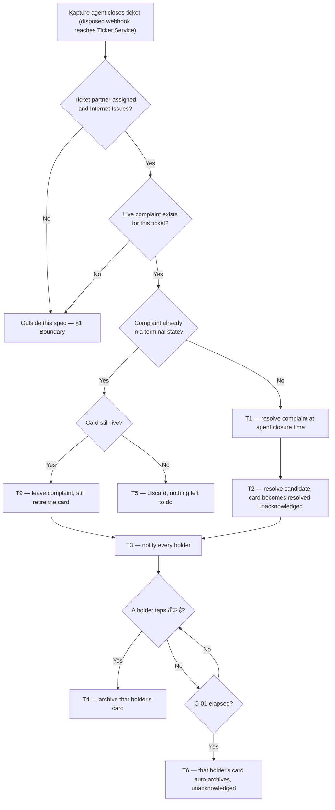

# Kapture Closure Sync — closure reaches the CSP's card

| | | | |
|---|---|---|---|
| **Owner** — Ashish Raj (PM) | **Reviewer** — Akash | **Status** — Signed off | **Sign-off** — Signed off · 18 Sep 2026 |
| **Version** — v1.0 · 18 Sep 2026 | **Consulted — Quality OS** — Akhil | | |

---

## 1. Objective & Guardrails

**Objective.** Once Wiom knows a customer is in pain no more, the ticket closes — Wiom does not wait on the CSP to mark it resolved, and does not penalise them for not marking it. The CSP is told at once, is never sent to a job that no longer exists, and is never recorded late for a fault that was fixed on time.

**Boundary.** This spec governs a **Kapture-side closure of a partner-assigned Internet Issues ticket that still has a live SRS complaint** — the path that today reaches Ticket Service Java and stops there. It leaves unchanged: the CSP-initiated resolution path, which already works and reaches Kapture in about one second (AC-REG-1); the SHIFTING task family, which keeps today's behaviour entirely (AC-REG-2); the reopen model, where a reopened ticket still creates a fresh complaint with a fresh deadline (AC-REG-3); the connectivity-check verification path, which this spec neither calls nor changes (AC-REG-4); and the Quality resolution signal's payload, which gains no field and loses none, so Quality scores an agent-closed complaint exactly as it scores any other (AC-REG-5). It does change one thing outside itself: a resolved-unacknowledged card must render as active rather than greyed, so that ठीक है can be tapped (R4c). Every other card type keeps today's behaviour (AC-REG-6).

### Guardrails — promises that hold on every path

| ID | Guardrail | One line | Anchors |
|---|---|---|---|
| G1 | **Never late for work done on time** (zero tolerance) | A CSP is never recorded as breaching a deadline for a fault Wiom closed before that deadline. | R1 · R5 · AC-R5-1 · AC-GRD-1 |
| G2 | **A closed fault asks for nothing** | Once the fault is closed — however it got there — the card offers no action that sends the CSP or a technician to the site. | R1 · R2 · AC-R1-6 · AC-R2-2 · AC-GRD-2 |
| G3 | **Wiom never waits on a tap it does not need** | When Kapture closes the ticket, the complaint reaches a terminal state on its own — the CSP's acknowledgement is never what closes it. | R1 · R4 · AC-R1-1 · AC-WF-2 · AC-GRD-3 |
| G4 | **One fault, one resolution** | A single fault produces one complaint resolution and one Quality signal, however many times the closure is delivered. | R1 · AC-DUP-1 · AC-GRD-4 |

---

## 2. Stories, Rules & Acceptance Criteria

### R1 — A Kapture closure resolves the complaint

| ID | Story | MUST | MUST NOT |
|---|---|---|---|
| R1 | As a CSP, when Wiom has already closed my customer's ticket, I want the complaint closed on my behalf so that my card and my deadline stop, without me doing anything. | **(a)** On a Kapture-side closure of a partner-assigned Internet Issues ticket, resolve the open complaint, stamping the resolution at the moment the agent closed it in Kapture. **(b)** Resolve the matching restore execution candidate, to the same end state a CSP's own resolve produces. **(c)** Record the call-centre agent as the actor who resolved it, carrying that agent's own identity through from Kapture — never the CSP, and never a shared system identity. **(d)** Emit exactly one resolution signal for the fault.. **(e)** Resolve the candidate even when the complaint has already reached a terminal state by another route — the card's life never depends on what the complaint's status happens to be. | Resolve a complaint whose ticket was not closed in Kapture; resolve a second time when the closure is delivered again; leave the complaint open once the closure has been accepted; leave a live card standing because the complaint was already terminal; record a resolution the CSP did not perform as though they performed it. |

| AC | Given / When / Then | Verifies | Status |
|---|---|---|---|
| AC-R1-1 | **Given** ticket 1786508079949000, complaint status `ASSIGNED`, `sla_at` = 2026-08-12T15:00 IST, and restore candidate state `PENDING_ACCEPTANCE`, **When** a Wiom agent closes that ticket in Kapture at 09:20:23 IST on 12 Aug, **Then** the complaint row reads `status` = CLOSED and `resolved_at` = 2026-08-12T09:20:23 IST, and the restore candidate reads `state` = COMPLETED. | R1a · R1b · G3 | Settled |
| AC-R1-2 | **Given** the closure in AC-R1-1, made by the Kapture agent whose employee id is 4417, **When** it is accepted at 09:20:23, **Then** the candidate reads `resolved_by_actor_type` = CC_AGENT and `resolved_by_actor_id` = 4417 — not the CSP a0b6v6, and not the shared system identity 137439087976. | R1c · R1 MUST NOT | Settled |
| AC-R1-5 | **Given** a Kapture closure whose payload carries no closing-agent employee id, **When** it is accepted, **Then** the candidate reads `resolved_by_actor_type` = CC_AGENT with an empty `resolved_by_actor_id`, and it still does not read CSP. | R1c | Settled |
| AC-R1-4 | **Given** the closure in AC-R1-1, **When** it is accepted at 09:20:23, **Then** exactly one resolution signal exists for complaint of ticket 1786508079949000, and `signal_emitted` reads true once. | R1d · G4 | Settled |
| AC-R1-6 | **Given** a complaint already at `UNRESOLVABLE` with `unresolvable_reason` = MAX_ESCALATION_REACHED, whose restore candidate is still `PENDING_ACCEPTANCE` and `is_csp_actionable` = true, **When** a Wiom agent closes that ticket in Kapture, **Then** the complaint row is unchanged and no second resolution signal is emitted, and the candidate reads `state` = COMPLETED with the card showing ठीक है. | T9 · R1e · G2 · G4 | Settled |
| AC-R1-3 | **Given** a ticket on the Wiom Net queue with `is_partnerassigned` = 0 and no row in `COMPLAINTS` for its `ticket_id`, **When** a Wiom agent closes it in Kapture, **Then** still no `COMPLAINTS` row exists for that `ticket_id` and no restore candidate was created. | R1 MUST NOT | Settled |

### R2 — The card says the work is done and asks only for acknowledgement

| ID | Story | MUST | MUST NOT |
|---|---|---|---|
| R2 | As anyone holding the card, I want it to tell me plainly that Wiom closed this and that nothing is left to do, so that I do not travel to a job that no longer exists. | **(a)** Add an update row to the ticket's Updates list, unread, carrying the supplied copy. **(b)** Leave the home card subtitle unchanged — the fault is still what the card is about, and the closure is told through the update row and the notification. **(c)** Replace the deadline block with the completed treatment the app already uses on a resolved restore — the label `schedule.deadline.completed`, no countdown. **(d)** Offer one action, **ठीक है**, and no other. **(e)** Raise the card in the feed, which by TAS's existing sort is what showing it means.. | Offer accept, assign-technician, start-work or resolve on the card; show a running countdown; show the card as still owing work. |

| AC | Given / When / Then | Verifies | Status |
|---|---|---|---|
| AC-R2-1 | **Given** the resolved candidate from AC-R1-1, **When** owner a0b6v6 opens the service drilldown, **Then** the Updates section shows one unread row reading "कस्टमर ने Wiom को बताया कि उनका नेट चल गया है, इस लिए Wiom ने यह टिकट रीज़ॉल्व कर दिया है" — in English, "The customer told Wiom their internet is working again, so Wiom has resolved this ticket." — and the unread count reads 1. | R2a | Settled |
| AC-R2-2 | **Given** the same card, **When** any holder opens the drilldown, **Then** the only action offered is ठीक है — accept, assign technician and resolve are all absent. | R2d · G2 | Settled |
| AC-R2-3 | **Given** the same card, whose `deadline_at` was 2026-08-12T15:00 IST, **When** a0b6v6 opens the drilldown at 09:25 IST, **Then** the schedule block reads "आपकी तरफ से काम पूरा हो गया" and no countdown pill is shown. | R2c | Settled |
| AC-R2-4 | **Given** owner a0b6v6 holding three other open cards, **When** the agent's closure is accepted at 09:20:23 and a0b6v6 opens the home feed at 09:25, **Then** the card for ticket 1786508079949000 is first in the feed and carries an unread badge, and its subtitle is the same fault text it showed before the closure. | R2b · R2e | Settled |

### R3 — The CSP is told without opening the app

| ID | Story | MUST | MUST NOT |
|---|---|---|---|
| R3 | As anyone working a ticket — the CSP, a manager on that account, or the technician it was assigned to — I want to be told that Wiom closed it so that I stop working it. | **(a)** On a closure, notify **every person holding the card**: the account owner, any manager on that account, and the assigned technician where there is one. **(b)** Opening the notification lands that person on the service drilldown for the ticket, showing ठीक है. **(c)** Opening the ticket directly lands on the identical screen. | Send the notification when that person's own resolve was the one that closed the ticket; leave the assigned technician untold because the CSP was told. |

| AC | Given / When / Then | Verifies | Status |
|---|---|---|---|
| AC-R3-1 | **Given** ticket 1786508079949000 held by owner a0b6v6, manager M and assigned technician T, **When** the closure from AC-R1-1 is accepted, **Then** a push notification naming that ticket is sent to all three. | R3a | Settled |
| AC-R3-4 | **Given** the same ticket with no technician assigned, **When** the closure is accepted, **Then** the notification goes to a0b6v6 and M only, and no technician notification is attempted. | R3a | Settled |
| AC-R3-2 | **Given** the notification sent to technician T, **When** T taps it, **Then** T's app opens the service drilldown for ticket 1786508079949000 with the ठीक है action visible — the same screen T reaches by opening the card from their feed. | R3b · R3c | Settled |
| AC-R3-3 | **Given** a ticket the CSP resolved in the app at 09:19, **When** Kapture records its own closure at 09:20 as the downstream echo of that resolve, **Then** no push notification is sent. | R3 MUST NOT · T5 | Settled |

### R4 — Acknowledgement archives the card

| ID | Story | MUST | MUST NOT |
|---|---|---|---|
| R4 | As anyone holding the card, I want it to stay live until **I** acknowledge it — even though the fault is already fixed — so that I see Wiom acted on my customer's problem before I did, and my own feed then holds only work I still owe. | **(a)** On ठीक है, archive the card **for the person who tapped**, and for nobody else. **(b)** Accept the tap from the account owner, a manager on that account, or the assigned technician. **(c)** Until that person taps, keep the card in their feed and **active**: it renders as live work carrying its actionable state, not as a finished card, so they see Wiom acted rather than finding the job quietly gone. **(d)** Archive a person's card without their tap once it has gone C-01 unacknowledged, so an unacknowledged card cannot pile up for ever. | Clear one person's card because somebody else tapped; make one person's card wait on another's tap; archive a card before that person acknowledged it and before C-01 has elapsed; render it as finished, greyed or unactionable while it still awaits the tap; reopen or re-activate the complaint on the tap; accept the tap from anyone other than the owner, a manager on the account, or the assigned technician. |

| AC | Given / When / Then | Verifies | Status |
|---|---|---|---|
| AC-R4-1 | **Given** the resolved, unacknowledged card from AC-R1-1 with no technician assigned, **When** owner a0b6v6 taps ठीक है, **Then** the card is no longer in that owner's feed, it is retrievable in their archive, and the complaint remains CLOSED with `resolved_at` unchanged at 09:20:23. | R4a · R4 MUST NOT | Settled |
| AC-R4-2 | **Given** the same card with technician T assigned before the closure, so that owner a0b6v6 and T both hold it, **When** T taps ठीक है, **Then** T's card archives and **a0b6v6's card is still in their feed, active, still carrying ठीक है**. | R4a · R4b · R4 MUST NOT | Settled |
| AC-R4-3 | **Given** the same card, **When** a CSP from another account opens it, **Then** ठीक है is not offered and nothing archives. | R4b · R4 MUST NOT | Settled |
| AC-R4-7 | **Given** the same card held by owner a0b6v6 and manager M on that account, **When** M taps ठीक है, **Then** M's card archives and the acknowledgement records M as the actor — a manager acknowledges on the CSP side. | R4b | Settled |
| AC-R4-8 | **Given** the card from AC-R4-2 where T tapped and a0b6v6 never did, **When** C-01 elapses, **Then** a0b6v6's card archives unacknowledged and T's archived state is unchanged. | R4d · T6 | Settled |
| AC-R4-5 | **Given** the closure accepted at 09:20:23, **When** owner a0b6v6 opens the feed at 09:21 without tapping ठीक है, **Then** the card is in their feed, not the archive. | R4c · R4 MUST NOT | Settled |
| AC-R4-6 | **Given** the resolved-unacknowledged card from AC-R1-1, **When** owner a0b6v6 opens the feed at 09:25, **Then** the card renders as active — not greyed — and carries its actionable state, so ठीक है can be tapped. | R4c · R4 MUST NOT | Settled |
| AC-R4-4 | **Given** the card resolved at 09:20:23 on 12 Aug and never acknowledged by owner a0b6v6, **When** a0b6v6 opens the feed on 20 Aug — eight days later, past C-01 (7 days) — **Then** the card is no longer in the feed and is retrievable in the archive, still unacknowledged. | R4d · C-01 | Settled |

### R5 — Quality scores the CSP at the moment the fault was fixed

| ID | Story | MUST | MUST NOT |
|---|---|---|---|
| R5 | As a CSP, I want to be judged on when my customer's fault was actually fixed, not on when I got round to tapping a button, so that I am not penalised for a sync failure. | **(a)** Score the complaint against the agent's closure time, not the acknowledgement time. **(b)** Keep the complaint on the CSP's scorecard — the call-centre agent performed the resolution (R1c), but the fault was the CSP's to fix and its TAT outcome stays theirs. | Record the complaint as breaching its deadline when the agent's closure fell before that deadline; score the ticket against the ठीक है tap; let the identity of the resolving actor change the score. |

| AC | Given / When / Then | Verifies | Status |
|---|---|---|---|
| AC-R5-1 | **Given** ticket 1786508079949000, raised 09:17, `sla_at` 15:00, closed by the agent at 09:20:23 and acknowledged by owner a0b6v6 at 16:59, **When** the resolution ledger is written, **Then** it reads `resolved_within_tat` = true and `excluded_from_scoring` = false. | R5a · G1 | Settled |
| AC-R5-3 | **Given** the closure in AC-R1-1, **When** the ledger row is written, **Then** its `csp_id` is a0b6v6 and it counts toward that CSP exactly as a CSP-performed resolution does — Quality does not differentiate on who resolved it. | R5b | Settled |
| AC-R5-2 | **Given** ticket 1786419974996000, raised 2026-08-11T09:12:34 IST with `sla_at` 2026-08-11T15:00, closed by the agent at 2026-08-12T17:18:17 — 26 h 18 min past the deadline, **When** the ledger is written, **Then** it reads `resolved_within_tat` = false. Closure sync does not rescue a fault that was already late. | R5a | Settled |

---

## 3. System Behaviour

### 3a. System flow chart

**Precedence:** a CSP resolve and a Kapture closure landing at the same instant resolve by first arrival — whichever reaches SRS first takes effect as T1, and the second is discarded as T5 (AC-RACE-1).

### 3b. State transition table — canon

Lifecycle of a **restore execution candidate** (created by SRS when it classifies a complaint). The complaint's own lifecycle sits in SRS and is out of scope except where these rows name it; the reopen lifecycle is out of scope entirely (§1 Boundary).

| ID | From | Action / Trigger | Rule / Check | To | Side-effects |
|---|---|---|---|---|---|
| T1 | PENDING_ACCEPTANCE · ACCEPTED · ASSIGNED_TECHNICIAN · IN_PROGRESS · AWAITING_VERIFICATION | Kapture closure accepted | Ticket partner-assigned, Internet Issues, complaint not terminal | (complaint CLOSED) | Complaint resolved with `resolved_at` = the agent's closure instant (R1a); one resolution signal emitted (R1d); scored against that instant (R5a). |
| T2 | PENDING_ACCEPTANCE · ACCEPTED · ASSIGNED_TECHNICIAN · IN_PROGRESS · AWAITING_VERIFICATION | T1 completed | — | COMPLETED (unacknowledged) | Candidate resolved, recording the call-centre agent and that agent's identity as the resolving actor (R1c); card becomes resolved-unacknowledged — active and actionable, update row added unread, home subtitle changed, deadline block replaced, ठीक है the only action (R2a–d, R4c); card raised in the feed (R2e). |
| T3 | COMPLETED (unacknowledged) | T2 completed | That person's own resolve was not the trigger | COMPLETED (unacknowledged) | One push notification per holder — owner, each manager on the account, and the assigned technician where there is one (R3a) — each deep-linking to the drilldown (R3b). |
| T4 | COMPLETED (unacknowledged) | A holder taps ठीक है | Actor is the account owner, a manager on that account, or the assigned technician | COMPLETED (archived) | Archived **for that person only**: their card leaves their feed and is retrievable in their archive (R4a); every other holder's card is untouched and still active (R4 MUST NOT); complaint untouched. |
| T5 | COMPLETED (unacknowledged) · COMPLETED (archived) · CANCELLED | Kapture closure accepted | — | unchanged | Closure discarded; no second resolution, no second signal, no notification (G4, R3 MUST NOT). The card is already retired, so nothing is left to do. |
| T6 | COMPLETED (unacknowledged) | C-01 elapses with no acknowledgement from a given holder | — | COMPLETED (archived) | Archived **for that person only**: their card leaves their feed unacknowledged and is retrievable in their archive (R4d); other holders are unaffected; complaint untouched. |
| T7 | COMPLETED (archived) | Kapture reopens the ticket within 48 h | — | (out of scope) | A fresh complaint and a fresh card are created by the existing reopen path; this candidate is untouched (§1 Boundary, AC-REG-3). |
| T8 | CANCELLED | Kapture closure accepted | — | CANCELLED | Not reachable as a change: a cancelled candidate is terminal, so the closure is discarded by T5. |
| T9 | PENDING_ACCEPTANCE · ACCEPTED · ASSIGNED_TECHNICIAN · IN_PROGRESS · AWAITING_VERIFICATION | Kapture closure accepted | Complaint already terminal — UNRESOLVABLE, CLOSED or REDIRECTED — while the card is still live | COMPLETED (unacknowledged) | Complaint untouched: no second resolution and no second signal (G4). The candidate is resolved anyway and the card becomes resolved-unacknowledged (R1e, R2a–d), because a closed fault must never leave a live card standing (G2). |

---

## 4. Screen Requirements

**Experience intent:** the CSP should see that Wiom already dealt with their customer's fault — not find the job quietly gone. The card stays in front of them, active, saying what happened and asking for one tap.

**Master design file:** [PA — Dev, January 2026 onwards, node 15165-12160](https://www.figma.com/design/W2Z3B5xfFO3UibJSzkyHn2/PA---Dev--%3E-January-2026-Onwards?node-id=15165-12160). Two surfaces change and one is deliberately left alone. Nothing here is a new component: the Updates row, the home subtitle, the schedule block and the primary CTA all exist today and are re-pointed.

Three things reach the CSP, in this order:

| # | Surface | When |
|---|---|---|
| 1 | Push notification — to the owner, each manager, and the assigned technician | Always, unless that person's own resolve caused the closure (R3a) |
| 2 | Home feed card — unread badge, raised; subtitle unchanged | Always (R2b, R2e) |
| 3 | Service drilldown — update row, completed schedule block, single CTA | On open (R2a, R2c, R2d) |

### Surface 1 — the push notification

**States:** sent (closure accepted, that person had not already resolved — T3) · not sent (their own resolve was the trigger — AC-R3-3). One notification per holder, on whichever app they use: the CSP app for an owner or manager, the technician's app for an assigned technician.
**Freshness:** sent when the closure is accepted. No delivery window is committed — see the Override on AC-FAIL-1; latency is not promised. **The notification is best-effort: the card in the feed is the sole guarantee.** A notification that never lands costs the CSP nothing, because the card is already there, active, carrying ठीक है (R2, R4c).

| Element | Source / Routes to | Logic |
|---|---|---|
| Field — body | fixed copy | **Hindi** — कस्टमर ने बताया नेट ठीक हो गया है · **English** — Customer says internet is working. |
| Field — heading | the service line and the customer's name | Rendered as "सर्विस · <customer name>", with the ticket reference and locality beneath — "WM-2214 · नेब सराय" — so the CSP knows which job it is before opening. |
| Action — tap | the service drilldown for that ticket | Lands on the identical screen a direct open reaches, with the ठीक है action visible (R3b, R3c). The same screen is reached on both apps. |

### Surface 2 — the home feed card

**States:** resolved-unacknowledged (active, unread) · archived (after ठीक है, or after C-01).
**Freshness:** the badge appears when the closure is accepted; the card rises at that same moment, because TAS sorts on latest_attention_at and raising the update is the rise (§7 TAS aggregation).

| Element | Source / Routes to | Logic |
|---|---|---|
| Field — subtitle | unchanged | Still the fault text. The closure reaches the CSP through the notification and the update row, not by rewriting the card's subject (R2b). |
| Field — unread badge | the unread update row | Shown until that holder opens the drilldown (R2a). |
| State — active | candidate is resolved-unacknowledged | Renders as live work — **not** greyed, not as a finished card — so ठीक है can be tapped and the holder can see Wiom acted (R4c). This is a change: terminal cards render greyed with no actionable dot today (§7 TAS aggregation). |
| Position — first in feed | latest_attention_at | First on arrival (R2e, AC-R2-4). No ordering rule is written, because raising the update already is the rise. |

### Surface 3 — the service drilldown

**States:** resolved-unacknowledged — the only state this spec introduces · archived.
**Freshness:** rendered from the candidate on open.

| Element | Source / Routes to | Logic |
|---|---|---|
| Section — Updates (अपडेट) | new unread row, top of the list | **Hindi** — कस्टमर ने Wiom को बताया कि उनका नेट चल गया है, इस लिए Wiom ने यह टिकट रीज़ॉल्व कर दिया है · **English** — The customer told Wiom their internet is working again, so Wiom has resolved this ticket. Unread count reads 1 (R2a, AC-R2-1). |
| Section — Important information (ज़रूरी जानकारी) | unchanged | Keeps showing the issue type alone. This spec adds no comment there — the updated design removed the one the original carried. |
| Section — schedule (कब तक करना है?) | schedule.deadline.completed | Countdown suppressed; the block reads "आपकी तरफ से काम पूरा हो गया" / "Your work is complete" (R2c). Reuses what the app already does on a resolved restore (§7 CSP app), so the live countdown in the mock is a mock artefact, not a requirement. |
| Action — ठीक है | archives the card for whoever tapped | The only action offered; accept task, assign technician, start work and resolve are all absent (R2d, G2). Offered on both apps, to the account owner, a manager on that account and the assigned technician (R4b). One person's tap never clears another's card (R4a). |
| Sections — address, contact, connection details | unchanged | Still rendered, so a holder can reach the customer after acknowledging. |

---

## 5. Cross-cutting Acceptance Criteria

| AC | Given / When / Then | Verifies | Status |
|---|---|---|---|
| AC-WF-1 | **Given** ticket 1786508079949000 raised 09:17 with `sla_at` 15:00, a card at PENDING_ACCEPTANCE, and owner a0b6v6 as its only holder — no manager on the account and no technician assigned, **When** the agent closes it in Kapture at 09:20:23, a0b6v6 is notified, and **a0b6v6 taps ठीक है at 16:59**, **Then** the complaint closed at 09:20:23, the ledger reads `resolved_within_tat` = true, no technician was ever dispatched, and a0b6v6's card is in their archive — put there by their own tap, not by time. | T1 · T2 · T3 · T4 · G1 · G2 | Settled |
| AC-WF-2 | **Given** the same ticket and holder, **When** the agent closes it at 09:20:23 and a0b6v6 never opens the app, **Then** the complaint is still CLOSED, the ledger still reads `resolved_within_tat` = true, and a0b6v6's score is unaffected by the missing acknowledgement; the card stays active in their feed until C-01 elapses and then archives itself, still unacknowledged. This is the only way a card reaches the archive without a tap. | T1 · T2 · T6 · G1 · G3 · C-01 | Settled |
| AC-WF-3 | **Given** a card at ASSIGNED_TECHNICIAN with technician T due on site, so owner a0b6v6 and T both hold it, **When** the agent closes the ticket in Kapture, **Then** both are notified, both cards offer only ठीक है, and T has no action that sends them to the site. | T2 · T3 · G2 | Settled |
| AC-FAIL-1 | **Given** a Kapture closure for ticket 1786508079949000 that SRS rejects with a 500, **When** the delivery fails, **Then** a record of the failure exists naming that ticket id and the agent's closure instant of 09:20:23, so the complaint can later be closed against that instant rather than against the CSP. | R1a · G1 | Settled |
| AC-REG-1 | **Given** a card at ACCEPTED whose complaint is open, **When** CSP a0b6v6 taps Resolve in the app at 11:00:00, **Then** the complaint's `resolved_at` is 11:00:00, the Kapture ticket reaches `is_resolved` = 1, and no ठीक है card and no push notification are produced for that ticket. | §1 Boundary | Settled |
| AC-REG-2 | **Given** a SHIFTING candidate in `RESTORE_EXECUTION_CANDIDATES` with `task_family` = SHIFTING at state ACCEPTED, **When** a Wiom agent closes its ticket in Kapture, **Then** the candidate's `state` and `is_csp_actionable` are unchanged, no update row is added to it, and its allowed actions still include the shifting set. | §1 Boundary | Settled |
| AC-REG-3 | **Given** an acknowledged, archived card from AC-R4-1, **When** an agent reopens that ticket in Kapture 20 hours later, **Then** a second `COMPLAINTS` row exists for that `ticket_id` with its own `sla_at`, a second candidate exists, and the archived candidate's `state` and `resolved_at` are unchanged. | §1 Boundary · T7 | Settled |
| AC-REG-4 | **Given** a complaint with `secondary_subtype` = NO_INTERNET, **When** CSP a0b6v6 taps Resolve in the app, **Then** the complaint's `verification_method` and `system_verification_result` are written exactly as they are today, and no closure-sync path has read or altered either. | §1 Boundary | Settled |
| AC-REG-5 | **Given** the closure in AC-R1-1, **When** SRS emits `COMPLAINT_RESOLUTION_SIGNAL`, **Then** the payload carries the same 25 fields it carries for a CSP-performed resolution, with `csp_id` = a0b6v6, `within_tat` = 1 and `executor_type` = CSP — no actor field is added, and Quality's scoring is byte-for-byte what it would have been. | §1 Boundary · R5 MUST NOT | Settled |
| AC-REG-6 | **Given** an ordinary resolved restore card that was acknowledged, and a completed install card, **When** each passes its 7-day and 30-day boundary, **Then** both retire exactly as they do today, and neither renders differently — the active-rendering change reaches resolved-unacknowledged cards only. | §1 Boundary · R4c | Settled |
| AC-GRD-1 | **Given** every complaint closed by a Kapture closure that landed before its `sla_at` across a full month, **When** the ledger is read, **Then** none reads `resolved_within_tat` = false. On the month measured this converts 410 recorded breaches to on-time. | G1 · R5a | Settled |
| AC-GRD-2 | **Given** a resolved-unacknowledged card reached from each of PENDING_ACCEPTANCE, ACCEPTED, ASSIGNED_TECHNICIAN, IN_PROGRESS and AWAITING_VERIFICATION in turn, **When** any holder opens each one, **Then** every one offers ठीक है alone — accept task, assign technician, start work and resolve are absent from all five. | G2 · R2d | Settled |
| AC-GRD-3 | **Given** every partner-assigned Internet Issues ticket closed in Kapture across a full month, **When** complaint statuses are read seven days later, **Then** none is still open. On the month measured, 1,774 were. | G3 · R1a | Settled |
| AC-GRD-4 | **Given** one fault, **When** its ticket is closed in Kapture and the closure is delivered three times, **Then** exactly one complaint resolution and one resolution signal exist. | G4 · R1d | Settled |
| AC-RACE-1 | **Given** a card at ACCEPTED, **When** the CSP taps Resolve at 09:20:23.100 and the agent's Kapture closure arrives at 09:20:23.400, **Then** the complaint carries `resolved_at` = 09:20:23.100 from the CSP's own resolve, the Kapture closure is discarded, and no ठीक है card or notification is produced. | T5 · R3 MUST NOT | Settled |
| AC-DUP-1 | **Given** the closure from AC-R1-1 already accepted and the complaint CLOSED, **When** the same closure is delivered again, **Then** `resolved_at` is unchanged at 09:20:23, no second signal is emitted, and no second notification is sent. | T5 · G4 | Settled |
| AC-DUP-3 | **Given** a candidate already at CANCELLED, **When** a Kapture closure for its ticket is delivered, **Then** the candidate stays CANCELLED, no card is produced and no notification is sent. | T8 · T5 · G4 | Settled |
| AC-DUP-2 | **Given** the resolved, unacknowledged card, **When** owner a0b6v6 taps ठीक है twice within one second, **Then** a0b6v6's card archives once and the second tap changes nothing. | T4 | Settled |
| AC-BV-1 | **Given** the card resolved at 2026-08-12T09:20:23 and never acknowledged, **When** owner a0b6v6, who has not tapped, opens the feed at 2026-08-19T09:20:22 — one second inside C-01 (7 days) — **Then** their card is in the feed, active, still carrying ठीक है. | R4c · C-01 | Settled |
| AC-BV-2 | **Given** the same unacknowledged card, **When** a0b6v6 opens the feed at 2026-08-19T09:20:24 — one second past C-01 — **Then** their card is in the archive, not the feed. | R4d · C-01 | Settled |
| AC-BV-3 | **Given** the same unacknowledged card, **When** a0b6v6 opens the archive at 2026-09-11T09:20:24 — one second past TAS's 30-day terminal retention — **Then** their card is gone from both feed and archive, exactly as an acknowledged card of the same age would be. | R4d | Settled |
| AC-BV-4 | **Given** a CSP with zero other cards, **When** the agent's closure is accepted, **Then** the resolved-unacknowledged card is the only card in that holder's feed and is first by definition. | R2e | Settled |

---

## 6. Configurability

| ID | Parameter | Value / Default | Kind | Range · Owner · Why configurable |
|---|---|---|---|---|
| C-01 | How long a resolved-unacknowledged card stays in the feed before it archives itself | 7 days | Configurable | 1–30 days · TAS / Product Ops · an unacknowledged card accumulates, and the tail is steep — the median CSP sees 2 a month, the heaviest 240 — so the window is tuned down if feeds fill and up if CSPs lose cards before they act |

---

## 7. Impacted Systems & References

| System / Service | Impact | Reference material | What was checked · ACs grounded on it |
|---|---|---|---|
| Ticket Service Java | Must send the closure onward to SRS — the single missing link | `controller/KaptureTicketController.java:842,892` (disposed webhook sets local status RESOLVED with system user 137439087976); `client/SrsClient.java` | The webhook already receives every Kapture closure and already resolves the ticket locally. `SrsClient` has only `notifyComplaint` and `notifyReopenComplaint` — there is no close or resolve call, which is precisely why the closure stops here. **The closing agent's identity already arrives**: `KaptureTaskDetails.java:101-102` declares `ticketCloseEmpId`, and a repository-wide search finds no read of it — it is deserialised and dropped, after which the closure is stamped with the shared system id 137439087976. R1c needs no new field from Kapture, only that this one stops being discarded. **Delivery to SRS has no safety net**: `SrsClient.java:165-205` is a single synchronous POST that logs and returns on a 4xx/5xx or an exception — no retry, no queue, no reconciliation — so a dropped closure is silent. A dropped closure therefore has no automatic recovery, which is what AC-FAIL-1 makes findable · AC-R1-1 · AC-R1-2 · AC-R1-3 · AC-FAIL-1 |
| SRS — `csp-support-resolution-service` | Must accept a closure and resolve the complaint | `api/InboundEventController.java:31` (`/srs/events/*`, 9 existing inbound event endpoints); `COMPLAINTS` columns `status`, `resolved_at`, `closed_timestamp`, `sla_at`, `within_tat`, `signal_emitted`, `verification_method`, `system_verification_result` | An inbound-event endpoint pattern already exists and is the natural home for this; `resolved_at` is a distinct column from `closed_timestamp`, and scoring keys on the former. The verification columns are named so AC-REG-4 has an observation point · AC-R1-1 · AC-R5-1 · AC-REG-4 |
| TAS restore — `csp-tas-service` | Already completes the candidate on `COMPLAINT_RESOLVED`; must additionally hold a resolved-but-unacknowledged card and accept the acknowledgement. Must not act on the SHIFTING family | `application/impl/InboundEventProcessingServiceImpl.java:94-119`; `domain/model/CandidateState.java`; `domain/model/ResolverActorType.java`; `RESTORE_EXECUTION_CANDIDATES` columns `task_family`, `state`, `is_csp_actionable`, `resolved_by_actor_type`, `resolved_by_actor_id` | The resolve half is built and idempotent — it dedupes on event id and acts only on non-terminal candidates, so T5 is already the existing behaviour. `ResolverActorType` is CSP · TECHNICIAN · OTHER, derived from the JWT role — **it has no value for a call-centre agent**, so R1c needs one added rather than collapsing the case into OTHER, which would lose exactly the fact this rule exists to record. It also collapses **MANAGER and MANAGER_PLUS into OTHER** (`ResolverActorType.java:9-10` maps only OWNER and TECHNICIAN), so R4b needs those recognised on the CSP side. **Acknowledgement is held once per candidate today** — `ackedAttentionVersion` is a single value — while R4a needs it per person, so one holder's tap cannot clear another's card. `task_family` is RESTORE or SHIFTING, giving AC-REG-2 its observation point · AC-R1-2 · AC-DUP-1 · AC-REG-2 |
| TAS aggregation (feed) | Card ordering, and **must change**: a resolved-unacknowledged card has to render as active rather than greyed. The age windows are reused, not changed | `aggregation/service/AggregationEngine.java:40,53,152`; `aggregation/config/TasParameters.java:44-75` | The v2 feed sorts on `latest_attention_at` DESC and nothing else, so raising the update *is* the rise — no ordering rule is needed or possible. **Terminal cards render greyed with no actionable dot** (`AggregationEngine.java:53,152`). A resolved-unacknowledged card is terminal by candidate state, so on today's rendering it would arrive greyed and untappable — and ठीक है could not be tapped at all. R4c needs that rendering exempted along with the windows. **Two existing windows govern how long a resolved card survives, and this feature sets neither:** the gateway's v2 inline feed window is **7 days**, after which the card is reachable only in the archive, and `terminalRetention` is **30 days**, after which it is gone from both. The 7-day window already delivers R4d's auto-archive, so C-01 names a behaviour the platform has rather than asking for a new timer — it is listed as configurable because the value, not the mechanism, is what may need to move. What must change is the rendering, not the windows · AC-R2-4 · AC-R4-4 · AC-BV-1 · AC-BV-2 · AC-BV-3 |
| CSP app | Renders the resolved treatment and the ठीक है action | `RestoreDrilldownContent.kt:298-307`; `ScheduleSection.kt:44-65`; `install_labels_v1.4_hi_en.json:118` | The completed deadline treatment already exists: on a resolved restore the app passes `deadlineAt = null` and `isCompleted = true`, and the block renders `schedule.deadline.completed` — "आपकी तरफ से काम पूरा हो गया" / "Your work is complete". R2c reuses it rather than adding anything · AC-R2-3 |
| Quality signal — `COMPLAINT_RESOLUTION_SIGNAL` | Must stay unchanged: the payload is what Quality scores from | `domain/event/outbound/ComplaintResolutionSignalEvent.java:15-41` (25 fields); emitted at `application/impl/ComplaintServiceImpl.java:626` | **The payload carries no actor.** There is no `resolved_by_actor_type`, `resolved_by_actor_id` or agent identity on it, so Quality cannot differentiate on who resolved a complaint — it is not a policy choice, the fact never reaches it. `executor_type` is the nearest field and is not the resolver at all — it is fixed at classification from the fault class alone (`ComplaintServiceImpl.java:128-130`: SERVICE_ISSUE and INSTALLATION_DEFECT → CSP, SYSTEM_ANOMALY → PLATFORM), before anyone has touched the ticket. Production bears that out: CSP with the CSP's own id on every service complaint, NULL only on the 11,841 REDIRECTED ones. R1c therefore records the agent on the TAS candidate only, which Quality never reads · AC-REG-5 · AC-R5-3 |
| Quality OS — `csp-quality-service` | Reads the resolution and scores the CSP | `COMPLAINT_RESOLUTION_LEDGER` columns `resolved_within_tat`, `excluded_from_scoring`, `tat_window_hours` | Of 395 tickets where Kapture closed inside the deadline and the CSP marked late, 393 are recorded `resolved_within_tat` = false and none excluded — so the penalty is real and the ledger is the place it must change · AC-R5-1 · AC-GRD-1 |
| Measurement | Sizing and the ACs' concrete data | `kapture-closure-sync-study/notes/04-tree.md`; `queries/tree-all-nodes.sql`, `waste.sql`, `ledger.sql`, `spot-check-sync-loss.sql` | 5,526 tickets/month closed in Kapture first (12.97% of resolved); 1,774 complaints never close; 1,078 technicians dispatched to resolved faults; 410 breaches wrongly scored · AC-GRD-1 · AC-GRD-3 · AC-REG-1 |

---

## 8. Glossary

| Term | Meaning | Owner (domain) |
|---|---|---|
| Kapture closure | A Wiom call-centre agent marking a ticket Completed, Resolved or Resolved on Call in Kapture. Reaches Ticket Service Java as a disposed webhook and, today, travels no further. | Support/Ops |
| Complaint | SRS's record of the customer's fault. Carries the classification, the deadline (`sla_at`), the resolution time and the Quality signal. One ticket may produce several complaints across a reopen chain. | SRS |
| Restore execution candidate | TAS's CSP-facing record of the work: the card, its allowed actions, its attention timers and its timeline. Created when SRS classifies a complaint; the thing the CSP actually sees and taps. | TAS |
| Resolved-unacknowledged | A card whose complaint and candidate are resolved, which stays active in the CSP's feed carrying one action — ठीक है — until that holder taps it, or C-01 elapses. It is deliberately not shown as finished: the holder is meant to see that Wiom closed the fault, not to find the card silently gone. | TAS |
| Archived | Reachable in a holder's archive rather than their feed. Today a card reaches this on age — the gateway's 7-day inline feed window (§7); under this spec, on that holder's acknowledgement, or on C-01 if they never tap. | TAS |
| Holder | Anyone the card appears for: the account owner, a manager on that account, and the technician the ticket was assigned to. Each holds their own copy — acknowledging clears only theirs (R4a). | TAS |
| CC agent | A Wiom call-centre agent working in Kapture. Identified by the Kapture employee id that arrives on the closure webhook as `ticketCloseEmpId`. Recorded as the resolving actor when a closure of theirs resolves a complaint (R1c). | Support/Ops |
| Ticket Service Java | The relay between Kapture and the OS. Receives Kapture webhooks, creates complaints in SRS, and pushes CSP resolutions back to Kapture. | Support/Ops |

---

## 9. Notes for System Capabilities

| Capability | Needed by |
|---|---|
| Carry a Kapture-side closure, with the instant the agent closed it, from the relay to the complaint's owner. | T1 · R1a · §7 Ticket Service Java |
| Resolve a complaint on an authority other than the CSP's own action, recording which actor did it, while the complaint stays on the CSP's scorecard. | T1 · T2 · R1c · R5b |
| Hold a card that is resolved yet still active and actionable in a holder's feed, so it can be acknowledged rather than read as finished. | T2 · T4 · T6 · R4c |
| Record an acknowledgement **per person holding a card**, archiving that person's copy on their own tap or on C-01, whichever comes first, and leaving every other holder's copy untouched. | T4 · T6 · R4a · R4d · C-01 |
| Notify every person holding a card — owner, managers, assigned technician — on whichever app they use, and deep-link each to that card. | T3 · R3a · R3b |
| Discard a closure that arrives for an already-terminal complaint, without a second resolution or signal. | T5 · G4 |

---

## Overrides

| Rule overridden | What was done instead | Rationale | Approved by |
|---|---|---|---|
| Template v4 defines no Screen Requirements section | §4 Screen Requirements added, in the shape the Handler Notice, Renewal Win-Back and Ticket Title Sync PRDs use | v4 dropped the section v3 carried. This feature changes three CSP-facing surfaces and has a design file, so the obligations needed one home instead of being scattered across R2, R3 and R4 | Ashish Raj · 18 Sep 2026 |
| Template §5 / J2 — a failure envelope must name a §6 window by whose expiry the outcome is guaranteed | AC-FAIL-1 states the outcome — a findable record naming the ticket and the agent's closure instant — with no window attached | PM removed both timing parameters that this document previously carried. The delivery path has no retry, so a window would have described a wait nobody implements; the record is what makes a dropped closure recoverable | Ashish Raj · 18 Sep 2026 |
| §2 — copy must be true of the case it fires on | The supplied copy asserts "कस्टमर ने Wiom को बताया कि उनका नेट चल गया है" on **all** Kapture closures, while 59% (3,260/mo) are closed on "ping is up, customer not called" and only 2.5% (138/mo) are a customer actually saying it works | PM chose full coverage of the gap over per-case copy accuracy, and chose to keep the supplied copy unchanged, after being shown the split | Ashish Raj · 17 Sep 2026 |
